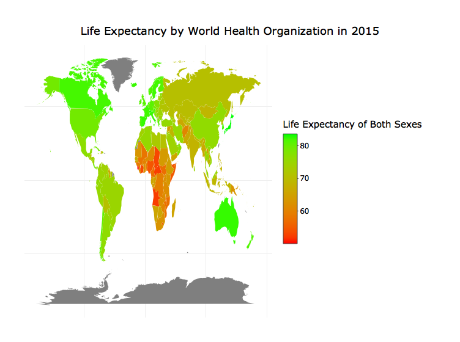
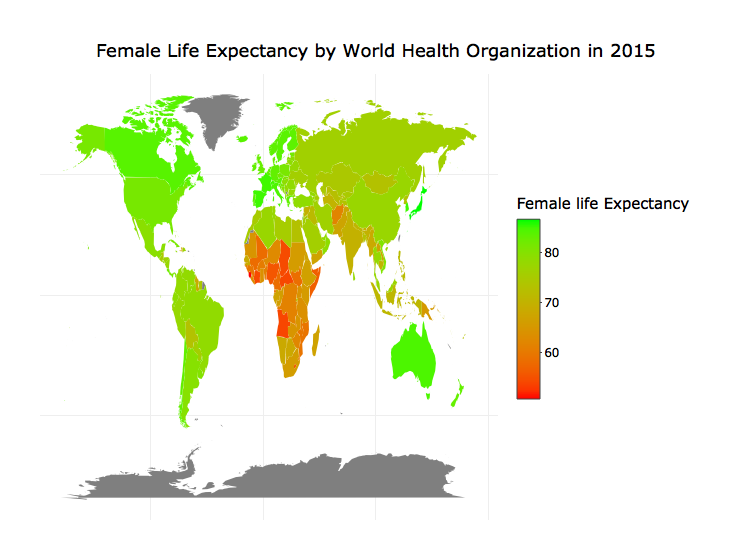
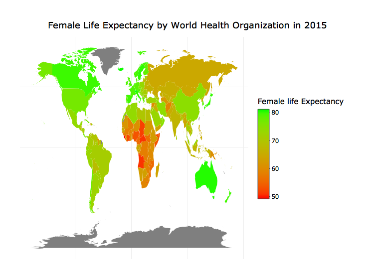

Untitled
================

``` r
library(rvest)
library(ggplot2)
library(ggmap)
library(dplyr)
library(plotly)
library(RColorBrewer)

#getting webpage
webpage <- read_html("https://en.wikipedia.org/wiki/List_of_countries_by_life_expectancy")

#getting list of table from html nodes
tbls <- html_nodes(webpage, "table")
tbls
```

    ## {xml_nodeset (7)}
    ## [1] <table class="wikitable sortable" style="text-align:center">\n<tr st ...
    ## [2] <table style="width:100%;"><tr>\n<td valign="top">\n<div class="lege ...
    ## [3] <table class="wikitable sortable">\n<caption>Life expectancy at birt ...
    ## [4] <table class="wikitable sortable">\n<caption>Life expectancy at birt ...
    ## [5] <table class="wikitable sortable">\n<tr style="background:#ececec; v ...
    ## [6] <table class="wikitable sortable">\n<caption>Life expectancy at birt ...
    ## [7] <table class="nowraplinks hlist collapsible autocollapse navbox-inne ...

``` r
#selected node
life_exp <- webpage %>%
  html_nodes(xpath = '//*[@id="mw-content-text"]/div/    table[1]') %>%
  .[1] %>%
  html_table(fill = TRUE)

str(life_exp)
```

    ## List of 1
    ##  $ :'data.frame':    183 obs. of  9 variables:
    ##   ..$ Country                           : chr [1:183] "Japan" "Switzerland" "Singapore" "Australia" ...
    ##   ..$ Both sexes
    ## rank                  : int [1:183] 1 2 3 4 4 6 6 8 9 9 ...
    ##   ..$ Both sexes life
    ## expectancy       : num [1:183] 83.7 83.4 83.1 82.8 82.8 82.7 82.7 82.5 82.4 82.4 ...
    ##   ..$ Female
    ## rank                      : int [1:183] 1 6 2 7 3 10 7 9 12 5 ...
    ##   ..$ Female life
    ## expectancy           : num [1:183] 86.8 85.3 86.1 84.8 85.5 84.1 84.8 84.3 84 85.4 ...
    ##   ..$ Male
    ## rank                        : int [1:183] 6 1 10 3 9 2 6 5 4 16 ...
    ##   ..$ Male life
    ## expectancy             : num [1:183] 80.5 81.3 80 80.9 80.1 81.2 80.5 80.6 80.7 79.4 ...
    ##   ..$ Both sexes
    ## rank (HALE)           : int [1:183] 1 4 2 15 9 7 5 5 12 8 ...
    ##   ..$ Both sexes life
    ## expectancy (HALE): num [1:183] 74.9 73.1 73.9 71.9 72.4 72.7 72.8 72.8 72 72.6 ...

``` r
#data frame the nodes
life_exp <- as.data.frame(life_exp)

#rename the variable
names(life_exp)
```

    ## [1] "Country"                           "Both.sexes.rank"                  
    ## [3] "Both.sexes.life.expectancy"        "Female.rank"                      
    ## [5] "Female.life.expectancy"            "Male.rank"                        
    ## [7] "Male.life.expectancy"              "Both.sexes.rank..HALE."           
    ## [9] "Both.sexes.life.expectancy..HALE."

``` r
names(life_exp) <- make.names(names(life_exp))
colnames(life_exp) <- c("country","Both_sexes_rank", "Both_sexes_life_exp", "Female_rank","Female_life_exp", "Male_rank","Male_life_exp", "Both_sexes_rank(HALE)", "Both_life_exp(HALE)")

#checking for null value
sum(is.na(life_exp))
```

    ## [1] 0

``` r
#getting world maps
world_map <- map_data("world")

#see the difference of code between two object
setdiff(life_exp$country, world_map$region)
```

    ## [1] "United Kingdom"                   "United States"                   
    ## [3] "Antigua and Barbuda"              "Saint Vincent and the Grenadines"
    ## [5] "Trinidad and Tobago"              "Congo"                           
    ## [7] "DR Congo"                         "Cote d'Ivoire"

``` r
#recode the object 
life_exp$country <- recode(life_exp$country, 
                           'United States' = 'USA',
                           'United Kingdom' = 'UK',
                           'Congo' = 'Republic of Congo',
                           'DR Congo' = 'Democratic Republic of the Congo',
                           "Cote d'Ivoire" = 'Ivory Coast')

#join the two object
map.world.joined <- left_join(world_map, life_exp, by = c('region' = 'country'))
```

``` r
#visualize the life expectancy of both sexes
a = ggplot(map.world.joined, aes(x = long, y = lat, group = group, fill = Both_sexes_life_exp)) +
  geom_polygon() + 
  scale_fill_gradient(low = "red", high = "green") +
  labs(title = 'Life Expectancy by World Health Organization in 2015', fill = 'Life Expectancy of Both Sexes')+
  theme_void()

ggplotly(a)
```



``` r
#visualise female life expectancy
b = ggplot(map.world.joined, aes(x = long, y = lat, group = group, fill = map.world.joined$Female_life_exp)) +
  geom_polygon() + 
  scale_fill_gradient(low = "red", high = "green") +
  labs(title = 'Female Life Expectancy by World Health Organization in 2015', fill = 'Female life Expectancy')+
  theme_void()

ggplotly(b)
```



``` r
#visualize male life expectancy
c = ggplot(map.world.joined, aes(x = long, y = lat, group = group, fill = map.world.joined$Male_life_exp)) +
  geom_polygon() + 
  scale_fill_gradient(low = "red", high = "green") +
  labs(title = 'Female Life Expectancy by World Health Organization in 2015', fill = 'Female life Expectancy')+
  theme_void()

ggplotly(c)
```


